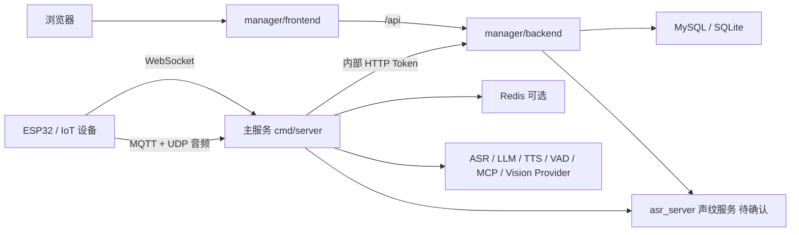

# PROJECT_MAP.md

## 项目整体架构

项目由“主服务 + 管理后台 + 前端控制台 + 可选声纹服务”组成。



核心思路：

- 设备通过 WebSocket 或 MQTT+UDP 接入主服务。
- 主服务为每个设备创建 `ChatManager`，在 hello 后创建 `ChatSession`。
- `ChatSession` 负责音频 VAD、ASR、LLM、TTS、MCP 工具、OpenClaw、历史消息和声纹相关流程。
- 管理后台后端保存用户、设备、智能体、配置、声纹、知识库、历史记录等数据。
- 主服务通过 `config_provider.type` 从 manager backend 或 Redis 获取设备/系统配置。
- 前端控制台通过 `/api` 访问 manager backend。

## 核心目录说明

### 主服务

- `cmd/server/main.go`：主服务入口，解析 `-c`、`-manager-enable`、`-manager-config`、`-asr-enable`、`-asr-config` 等参数，初始化配置、日志、Redis、鉴权、VAD，并启动 App。
- `cmd/server/config.go`：Viper 配置读取、日志初始化、设备日志、Redis、配置热更新、manager 配置拉取。
- `cmd/server/*_stub.go` / `*_disabled.go` / build tag 文件：控制 manager/asr_server 是否被编进主二进制。
- `internal/app/server/app.go`：主服务应用编排，启动 WebSocket server、内置 MQTT server、MQTT+UDP adapter、MCP、事件处理、资源池统计。
- `internal/app/server/websocket`：设备 HTTP/WebSocket API。
- `internal/app/server/mqtt_udp`：MQTT+UDP 传输层和 UDP session。
- `internal/app/server/chat`：对话核心。
- `internal/app/mqtt_server`：内置 MQTT server。

### 领域能力

- `internal/domain/asr`：ASR provider 与适配器，包含 FunASR、Doubao、Aliyun、Xunfei 等。
- `internal/domain/tts`：TTS provider，包含 Doubao、Edge、OpenAI 兼容、CosyVoice、Xunfei、Qwen、IndexTTS 等。
- `internal/domain/llm`：LLM provider，包含 Eino/OpenAI/Ollama/Dify/Coze 等相关实现。
- `internal/domain/vad`：VAD provider，包含 WebRTC VAD、Silero VAD、ten-vad。
- `internal/domain/mcp`：MCP client/manager、工具注册、设备侧 MCP、WebSocket transport。
- `internal/domain/memory`：nomemo、llm_memory、mem0、memobase 等记忆模式。
- `internal/domain/rag`：Dify、RAGFlow、WeKnora 知识库检索。
- `internal/domain/speaker`：声纹识别 provider 抽象。
- `internal/domain/openclaw`：OpenClaw 模式、消息路由和离线消息。
- `internal/domain/eventbus`：会话、历史、退出聊天等事件。
- `internal/domain/config`：配置 provider 抽象与实现。

### 管理后台后端

- `manager/backend/main.go`：manager backend 入口，读取配置、初始化数据库、设置 Gin mode、注册路由并启动。
- `manager/backend/config`：配置结构和 JSON 配置。
- `manager/backend/router/router.go`：REST API 路由集中定义。
- `manager/backend/controllers`：业务控制器。
- `manager/backend/models/models.go`：GORM 模型。
- `manager/backend/database/database.go`：数据库连接、AutoMigrate、兼容迁移。
- `manager/backend/middleware`：JWT、管理员、内部服务、OpenAPI Token 鉴权。
- `manager/backend/static`：前端静态资源嵌入适配，受 `embed_ui` build tag 控制。
- `manager/backend/services`：配置导入导出、MCP market 等服务。
- `manager/backend/storage`：本地/数据库存储适配。

### 管理后台前端

- `manager/frontend/src/main.js`：前端入口。
- `manager/frontend/src/router/index.js`：页面路由和登录/管理员守卫。
- `manager/frontend/src/utils/api.js`：Axios 实例，统一 `/api` baseURL 和 token 注入。
- `manager/frontend/src/views/admin`：管理员配置、用户、设备、智能体等页面。
- `manager/frontend/src/views/user`：普通用户智能体、设备、知识库、声纹、API Token 等页面。
- `manager/frontend/vite.config.js`：开发端口 `3000`，`/api` 代理到 `VITE_API_TARGET` 或 `http://127.0.0.1:8080`。

### 配置、文档、部署

- `config/config.yaml`：主服务配置。
- `config/mqtt_config.json`：独立 MQTT server 配置。
- `manager/backend/config/config.json`：manager backend 默认配置，当前默认 `database.type=mysql`。
- `manager/backend/config/config.local.json`：本地 SQLite 配置示例。
- `doc/compile_deploy.md`：分离部署与 AIO 构建说明。
- `doc/docker_compose.md`、`docker/docker-composer/docker-compose.yml`：Docker Compose 部署。
- `.github/workflows/build-release.yml`：Release 包构建。
- `.github/workflows/docker-build.yml`：GHCR 镜像构建。
- `scripts/xiaozhi-service.ps1`：Windows 发布包服务管理脚本。

## 各业务模块说明

### 设备接入

- WebSocket 入口：`internal/app/server/websocket/websocket_server.go` 的 `/dili/v1/`。
- MQTT+UDP 入口：WebSocket 协商 `/xiaozhi/mqtt_udp/v1/`，MQTT/UDP 适配在 `internal/app/server/mqtt_udp`。
- 设备连接建立后进入 `App.OnNewConnection`，按 deviceID 创建或替换 `ChatManager`。

### 对话链路

- `ChatManager`：`internal/app/server/chat/chat.go`，管理设备级连接、hello、文本命令循环、音频循环、session 生命周期。
- `ChatSession`：`internal/app/server/chat/session.go`，初始化 ASR/LLM/TTS、处理 VAD 后文本、MCP 工具、声纹、OpenClaw、历史。
- ASR 管理：`internal/app/server/chat/asr.go`。
- LLM 管理：`internal/app/server/chat/llm.go`。
- TTS 管理：`internal/app/server/chat/tts.go`。
- 工具调用：`internal/app/server/chat/tool.go`、`mcp.go`、`local_mcp_tool.go`。

### 配置管理

- 主服务启动先读取本地 `config/config.yaml`。
- 当 `config_provider.type=manager` 时，主服务通过 `internal/domain/config/manager` 调 manager backend：
  - `/api/configs` 获取设备配置。
  - `/api/system/configs` 获取系统配置。
  - `/api/internal/*` 处理设备激活、历史、池统计、角色切换等内部接口。
- 当 `config_provider.type=redis` 时，走 Redis provider，具体数据结构需继续阅读 `internal/domain/config/redis`。

### 管理后台

- 登录/注册/setup：`manager/backend/controllers/auth.go`、`setup.go`。
- 管理员配置：`manager/backend/controllers/admin.go` 及拆分文件。
- 用户/设备/智能体：`user.go`、`agent_device_service.go`。
- 声纹组/样本：`speaker_group.go`。
- 声音复刻：`voice_clone*.go`。
- 知识库：`knowledge*.go`。
- MCP market：`mcp_market*.go`、`services/mcp_market`。
- 聊天历史：`chat_history.go`。

### 数据库

数据库模型集中在 `manager/backend/models/models.go`，包括：

- `User`、`APIToken`
- `Device`
- `Agent`
- `KnowledgeBase`、`KnowledgeBaseDocument`、`AgentKnowledgeBase`
- `Config`
- `MCPMarketService`
- `GlobalRole`、`Role`
- `SpeakerGroup`、`SpeakerSample`
- `VoiceClone`、`VoiceCloneAudio`、`VoiceCloneTask`、`UserVoiceCloneQuota`
- `ChatMessage`

数据库初始化和迁移在 `manager/backend/database/database.go`。该文件使用 GORM `AutoMigrate`，并包含若干兼容迁移和修复逻辑，例如 `dropDeprecatedAgentStatusColumn`、`migrateGlobalRolesToRoles`、`repairConfigProviders`。

## 常见需求应该从哪里开始改

- 新增设备协议消息：先看 `internal/data/client.ClientMessage`、`internal/data/msg`，再看 `ChatManager.handleTextMessage`。
- 修改设备 WebSocket 路由：从 `internal/app/server/websocket/websocket_server.go` 开始。
- 修改 MQTT+UDP 音频链路：从 `internal/app/server/mqtt_udp` 和 `internal/app/server/chat/speak_request_test.go` 开始。
- 新增 ASR provider：从 `internal/domain/asr/base.go`、已有 provider 目录和 `internal/data/client.InitAsr` 开始。
- 新增 TTS provider：从 `internal/domain/tts/base.go`、已有 provider 目录和 `internal/app/server/chat/tts.go` 开始。
- 新增 LLM provider：从 `internal/domain/llm/base.go`、`llm.go`、`eino_llm` 或 OpenAI 兼容实现开始。
- 修改 MCP 工具：从 `internal/domain/mcp` 和 `internal/app/server/chat/local_mcp_tool.go` 开始。
- 修改 OpenClaw：从 `internal/domain/openclaw` 和 `internal/app/server/chat/openclaw_*.go` 开始。
- 修改管理后台 API：先看 `manager/backend/router/router.go` 找路由，再进对应 `controllers`。
- 修改管理后台页面：先看 `manager/frontend/src/router/index.js` 找页面，再改 `views/admin` 或 `views/user`，API 调用看 `utils/api.js`。
- 修改数据库字段：先看 `manager/backend/models/models.go` 和 `database/database.go`，确认 AutoMigrate 影响。
- 修改发布构建：看 `.github/workflows/build-release.yml`、`docker/Dockerfile.*`、`doc/compile_deploy.md`。

## 核心调用链路

### 主服务启动

1. `cmd/server/main.go` 解析命令行参数。
2. 如 build tag 支持且参数启用，先启动内嵌 manager / asr_server。
3. `Init(configFile)` 读取 `config/config.yaml`。
4. 初始化日志、设备日志、配置系统、从配置 provider 拉取系统配置、启动周期配置更新。
5. 初始化 VAD、Redis、设备侧 AuthManager。
6. `server.NewApp()` 创建 WebSocket server 和 MQTT+UDP adapter。
7. `App.Run()` 启动 WebSocket、内置 MQTT server、MQTT+UDP adapter、MCP、本地 MCP 工具、事件处理、资源池统计。

注意：`App.Run()` 内部有 `select {}` 阻塞，因此 `cmd/server/main.go` 中后续监听退出信号的代码在当前实现下可能无法执行到。是否为预期行为待确认。

### 设备 WebSocket 对话

1. 设备连接 `/dili/v1/`。
2. `WebSocketServer.internalHandleChat` 提取 `device-id` / `client-id`，升级 WebSocket。
3. 创建 `WebSocketConn` 并回调 `App.OnNewConnection`。
4. `App.OnNewConnection` 创建 `ChatManager` 并启动。
5. `ChatManager.cmdMessageLoop` 接收 hello/listen/abort/iot/mcp/goodbye 等文本消息。
6. `ChatManager.audioMessageLoop` 接收音频并交给当前 `ChatSession`。
7. hello 后 `ChatSession.Start` 初始化 ASR/LLM/TTS，并启动 VAD、文本队列、LLM、TTS loop。
8. VAD/ASR 得到文本后进入 `actionDoChat`，可能走 OpenClaw、退出词、声纹 TTS 切换、MCP tools、LLM、TTS。

### MQTT+UDP 对话

1. 内置 MQTT server 在 `internal/app/mqtt_server` 启动，设备生命周期通过 hook 发布。
2. MQTT client/adapter 在 `internal/app/server/mqtt_udp` 订阅/处理设备消息。
3. UDP server 创建 AES session，用于音频上行/下行。
4. 对话层仍复用 `ChatManager` / `ChatSession`。
5. 主动播报场景通过 `speak_request` / `speak_ready` 协商热链路。

### 管理后台调用主服务

1. 前端页面通过 Axios `/api` 调 manager backend。
2. manager backend 路由在 `router.go`。
3. 主服务通过 manager provider 调用 `/api/configs` 和 `/api/system/configs` 获取配置。
4. manager backend 通过 WebSocket controller 和内部事件机制与在线设备/智能体相关能力交互。

### 历史消息

1. 会话中产生消息事件，发布到 `eventbus.TopicAddMessage`。
2. `internal/app/server/message_handle.go` 的 `MessageWorker` 按 session/device hash 分发。
3. `config_provider.type=redis` 时写 Redis 短期记忆。
4. `config_provider.type=manager` 时通过 `internal/data/history` 调 manager backend 内部历史接口。
5. 长期记忆 provider（memobase/mem0 等）独立处理。

## 配置说明

主服务配置：`config/config.yaml`

重点配置段：

- `server.pprof`
- `auth`
- `chat`
- `chat_hooks`
- `config_provider`
- `manager`
- `system_prompt`
- `log`
- `redis`
- `websocket`
- `mqtt`
- `mqtt_server`
- `udp`
- `resource_pools`
- `vad`
- `asr`
- `tts`
- `llm`
- `vision`
- `ota`
- `mcp`
- `local_mcp`
- `memory`
- `voice_identify`

管理后台配置：`manager/backend/config/config.json` / `config.local.json`

重点配置段：

- `server.port` / `server.mode`
- `database.type`
- `database.mysql`
- `database.sqlite`
- `jwt`
- `internal_auth_token`
- `endpoint_auth_token`
- `speaker_service.url`
- `storage`
- `history`

前端开发代理：`manager/frontend/vite.config.js`

- 默认端口：`3000`
- `/api` 默认代理到 `http://127.0.0.1:8080`
- 可通过 `VITE_API_TARGET` 覆盖。

## 数据库模型位置

- 模型定义：`manager/backend/models/models.go`
- 数据库初始化：`manager/backend/database/database.go`
- SQLite 默认文件示例：`manager/backend/data/xiaozhi.db`
- 配置：`manager/backend/config/config.json` 和 `manager/backend/config/config.local.json`

注意：仓库中存在 SQLite 数据文件，通常属于本地/示例数据，不应随意修改或提交。

## 接口定义位置

- 主服务设备接口：`internal/app/server/websocket/websocket_server.go`
- 主服务消息类型：`internal/data/client/client.go`、`internal/data/msg/message_types.go`
- MQTT/UDP 协议：`doc/mqtt_udp_protocol.md`、`internal/app/server/mqtt_udp`
- 管理后台 REST 路由：`manager/backend/router/router.go`
- 前端路由：`manager/frontend/src/router/index.js`
- 前端 API client：`manager/frontend/src/utils/api.js`
- OpenAPI：前端有 `/openapi-docs` 页面，但未发现独立 OpenAPI spec 文件，待确认。

## 权限、登录、中间件位置

管理后台：

- 登录/注册：`manager/backend/controllers/auth.go`
- JWT 生成/解析：`manager/backend/middleware/auth.go`
- 管理员权限：`manager/backend/middleware/auth.go` 的 `AdminAuth`
- 内部服务鉴权：`manager/backend/middleware/internal_auth.go`
- OpenAPI Token/JWT 鉴权：`manager/backend/middleware/openapi_auth.go`
- 前端路由守卫：`manager/frontend/src/router/index.js`
- 前端 token 注入：`manager/frontend/src/utils/api.js`

设备侧：

- `internal/app/server/auth/auth.go`
- WebSocket handler 中设备 token 校验逻辑当前被注释，`ValidateToken` 当前直接返回 true，真实安全策略待确认。

## 启动流程

### 分离开发启动建议

1. 启动数据库：MySQL 或 SQLite。
2. 如需声纹，初始化并启动 `asr_server` 子模块服务，当前子模块未展开，待确认。
3. 启动 manager backend：

```bash
cd manager/backend
go run main.go -c config/config.local.json
```

4. 启动主服务：

```bash
go run ./cmd/server -c config/config.yaml
```

5. 启动前端：

```bash
cd manager/frontend
npm ci
npm run dev
```

### AIO 启动

AIO 构建会通过 build tags 将 manager、asr_server、embed_ui 编入主二进制。参考 `doc/compile_deploy.md`：

```bash
./xiaozhi_server -c main_config.yaml -manager-config manager.json -asr-config asr_server.json
```

Windows 发布包可用：

```powershell
.\scripts\xiaozhi-service.ps1 start
```

## 测试 / 构建 / 部署流程

测试：

- 根模块：`go test ./...`
- manager backend：`cd manager/backend && go test ./...`
- 前端：仓库未发现前端测试脚本，主要验证方式是 `npm run build`。

构建：

- 主服务普通构建：`go build -o xiaozhi_server ./cmd/server`
- manager backend：`cd manager/backend && go build -o main .`
- manager frontend：`cd manager/frontend && npm run build`
- AIO：`go build -tags "nolibopusfile asr_server manager embed_ui" ...`

部署：

- Docker Compose：`docker/docker-composer/docker-compose.yml`
- 单容器/镜像：`docker/Dockerfile.main`、`docker/Dockerfile.backend`、`docker/Dockerfile.frontend`
- Release：`.github/workflows/build-release.yml`
- Docker 镜像发布：`.github/workflows/docker-build.yml`

## 项目风险点和待梳理事项

- `asr_server` 子模块当前未展开，声纹服务真实入口、配置和 API 需初始化子模块后补充。
- 主服务 `App.Run()` 当前阻塞，`cmd/server/main.go` 后续优雅退出逻辑可能不可达，待确认是否为设计缺陷。
- 设备侧鉴权逻辑存在注释和 `ValidateToken` 直接返回 true 的情况，安全边界待确认。
- 管理后台 JWT secret 代码中有默认硬编码，同时配置文件也包含 jwt 配置，实际是否使用配置待确认。
- README 和部分文档在当前终端出现中文乱码，文档编码需统一确认。
- 配置文件中存在默认密码、token、API key 示例值，生产部署必须替换，文档和日志中不要泄露真实值。
- `manager/backend/database.go` 使用 AutoMigrate 并包含直接 `ALTER TABLE` 逻辑，数据库变更需谨慎评估 MySQL/SQLite 差异。
- 主服务、manager backend、asr_server 是多 module / submodule 结构，构建和测试边界容易混淆。
- `test/` 下更多是手工联调工具，不是统一 CI 测试入口。
- Docker Compose 文档和实际 compose 文件的部分端口/镜像版本可能存在差异，部署前需以实际 `docker-compose.yml` 为准。
