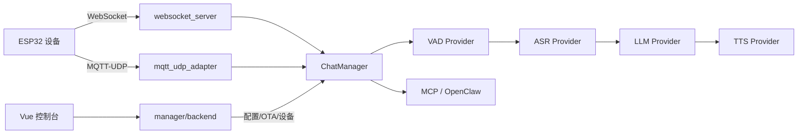

# PROJECT_MAP — dili-esp32-server-golang

ESP32 智能终端 AI 语音后端，端到端全流式 ASR → LLM → TTS，支持 WebSocket / MQTT-UDP 多协议接入与管理控制台。

> 由 governance-kit 初始化生成，请随代码演进更新（L2+ 见 DOC_SYNC）。

## 技术栈

| 层 | 技术 |
|----|------|
| 主服务 | Go 1.24、`cmd/server/` |
| 协议接入 | WebSocket、MQTT-UDP（`internal/app/server/`） |
| AI 链路 | VAD / ASR / LLM / TTS（`internal/domain/`） |
| 管理后端 | Gin + GORM（`manager/backend/`） |
| 管理前端 | Vue + Vite（`manager/frontend/`） |
| 家长小程序 | 微信小程序子模块（`manager/miniprogram/` → `xiaodi/dilidili_mp`） |
| 配置 | YAML（`config/config.yaml` 样例） |
| 部署 | Docker、AIO 预编译包（`docker/`、`build/`） |

## 目录地图

```
dili-esp32-server-golang/
├── cmd/
│   ├── server/              # 主服务入口（-c config/config.yaml）
│   ├── mqtt/                # MQTT 独立进程
│   └── mock_ai_server/      # 测试用 mock AI 服务
├── internal/
│   ├── app/                 # 应用层：协议服务、ChatManager、会话
│   ├── domain/              # 领域模块：VAD/ASR/LLM/TTS/MCP/RAG/配置
│   ├── components/          # 通用 HTTP 等组件
│   ├── data/                # 历史记录等数据访问
│   └── pool/                # 外部资源连接池
├── manager/
│   ├── backend/             # Gin 管理后台 API（:8080）
│   ├── frontend/            # Vue Web 控制台
│   └── miniprogram/         # 家长留言微信小程序（git submodule: dilidili_mp）
├── config/                  # 配置样例（*.pro/dev/local 勿提交）
├── doc/                     # 业务文档（既有）
├── test/                    # 协议/集成测试客户端
├── build/                   # AIO 构建配置
├── docker/                  # Docker Compose 部署
├── scripts/                 # 运维与治理脚本
└── docs/                    # 治理文档（本流程生成）
```

## 入口与命令

| 项 | 值 |
|----|-----|
| 主服务入口 | `cmd/server/main.go` |
| MQTT 入口 | `cmd/mqtt/main.go` |
| 管理后端入口 | `manager/backend/main.go` |
| 管理前端 | `manager/frontend/`（Vite dev server） |
| 编译 | `go build -o dili_server ./cmd/server/` |
| 启动 | `./dili_server -c config/config.yaml` |
| 测试 | `go test ./...` |
| 本地密钥 | `.env`、`config/*.pro.yaml`、`*.dev.yaml`、`*.local.*`、`*.pem`、`*.key`、`logs/`、`*.db`（勿提交） |

## 架构



主服务 `internal/app/server/app.go` 统一管理 WebSocket 与 MQTT-UDP 协议层，按设备维护 `ChatManager` 会话，驱动 VAD→ASR→LLM→TTS 全流式链路。

## 扩展点

| 模块 | 接口/工厂 | 实现目录 | 配置入口 |
|------|-----------|----------|----------|
| VAD | `internal/domain/vad/inter/` | `silero_vad/`、`webrtc_vad/`、`ten_vad/` | `config.yaml` vad 段 |
| ASR | `AsrProvider` | `internal/domain/asr/`（FunASR、Doubao、讯飞等） | config + manager |
| LLM | `LLMProvider` | `internal/domain/llm/`（Eino、Dify、Coze 等） | config + manager |
| TTS | `TTSProvider` | `internal/domain/tts/`（Doubao、Edge、CosyVoice 等） | config + manager |
| MCP | `internal/domain/mcp/` | SSE / WebSocket / StreamableHTTP transport | manager MCP 配置 |
| RAG | `Searcher` | `internal/domain/rag/`（Dify、RAGFlow、WeKnora） | manager 知识库 |
| 用户配置 | `config_provider` | `internal/domain/config/manager/`、`redis/` | `config.yaml` |
| Chat Hooks | `hooks.Hub` | `internal/domain/chat/hooks/` | `config.yaml` chat_hooks |
| 儿童故事 | `story.Service` / `create_child_story` | `internal/domain/story/`、`internal/app/server/chat/child_story_mcp_tool.go` | `config.yaml` story / local_mcp |
| OpenClaw | `internal/domain/openclaw/` | 智能体 Endpoint / 关键词路由 | manager 智能体配置 |

新增 provider 时：实现接口 → 注册工厂 → 配置样例 → L2 FEATURE.md → 更新本表。

## API / 对外接口

| 类型 | 路径/协议 | 代码位置 |
|------|-----------|----------|
| WebSocket 语音 | `ws://host:port/ws` | `internal/app/server/websocket/` |
| MQTT-UDP | MQTT 控制 + UDP 音频 | `internal/app/server/mqtt_udp/` |
| OTA | HTTP OTA 端点 | `internal/app/server/websocket/ota.go` |
| 管理 API | `/api/*`（Gin） | `manager/backend/router/router.go` |
| 小程序 API | `/api/mp/*` | `manager/backend/controllers/mp_*.go` |
| 家长留言内部 API | `/api/internal/.../parent-messages` | `manager/backend/controllers/parent_message_internal.go` |
| 内部服务 API | `/api/internal/*` | `manager/backend/controllers/` |
| Open API | `/api/open/v1/*` | `manager/backend/router/router.go` |
| MCP Endpoint | 按智能体/设备生成 | `internal/app/server/websocket/mcp.go` |
| OpenClaw | WebSocket Endpoint | `internal/app/server/websocket/openclaw.go` |

详细协议与配置见 `doc/` 目录（如 `websocket_server.md`、`mqtt_udp.md`、`mcp.md`）。

## 相关文档

- [HOW_TO_USE.md](dev/HOW_TO_USE.md)
- [CHANGELOG.md](dev/CHANGELOG.md)
- [README.md](../README.md) — 快速开始与功能概览
- [doc/config.md](../doc/config.md) — 配置详解

## 已知技术债

- 用户认证与权限体系（规划中，见 README Roadmap）
